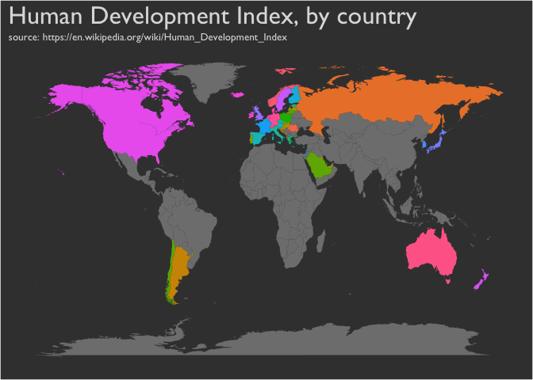

Human Development Index
================

Data source: <https://en.wikipedia.org/wiki/Human_Development_Index>

### Data Cleaning

``` r
library(rvest)
library(ggplot2)
library(ggmap)
library(dplyr)
library(RColorBrewer)
library(magrittr)

url <- "https://en.wikipedia.org/wiki/Human_Development_Index"

#getting the page
webpage <- read_html(url)

#getting list of table from html nodes
tbls <- html_nodes(webpage, "table")
tbls
```

    ## {xml_nodeset (20)}
    ##  [1] <table border="0" cellspacing="0" cellpadding="0" style="width:100% ...
    ##  [2] <table border="0" cellspacing="0" cellpadding="0" style="width:100% ...
    ##  [3] <table style="width:100%;"><tr>\n<td valign="top">\n<div class="leg ...
    ##  [4] <table class="wikitable" style="text-align:center">\n<tr>\n<th scop ...
    ##  [5] <table class="wikitable" style="text-align:center">\n<tr>\n<th scop ...
    ##  [6] <table class="wikitable" style="text-align:center">\n<tr>\n<th scop ...
    ##  [7] <table role="presentation" class="mbox-small plainlinks sistersiteb ...
    ##  [8] <table class="nowraplinks hlist collapsible autocollapse navbox-inn ...
    ##  [9] <table class="nowraplinks navbox-subgroup" style="border-spacing:0" ...
    ## [10] <table class="nowraplinks hlist collapsible autocollapse navbox-inn ...
    ## [11] <table class="nowraplinks hlist collapsible autocollapse navbox-inn ...
    ## [12] <table class="nowraplinks hlist collapsible collapsed navbox-inner" ...
    ## [13] <table class="nowraplinks navbox-subgroup" style="border-spacing:0" ...
    ## [14] <table class="nowraplinks navbox-subgroup" style="border-spacing:0" ...
    ## [15] <table class="nowraplinks navbox-subgroup" style="border-spacing:0" ...
    ## [16] <table class="nowraplinks navbox-subgroup" style="border-spacing:0" ...
    ## [17] <table class="nowraplinks navbox-subgroup" style="border-spacing:0" ...
    ## [18] <table class="nowraplinks collapsible autocollapse navbox-inner" st ...
    ## [19] <table class="nowraplinks collapsible autocollapse navbox-inner" st ...
    ## [20] <table class="nowraplinks hlist navbox-inner" style="border-spacing ...

``` r
#getting the table

HDI <- webpage %>%
  html_nodes(xpath = '//*[@id="mw-content-text"]/div/    table[1]') %>%
  .[1] %>%
  html_table(fill = TRUE)

HDI <- as.data.frame(HDI)

#remove first row
HDI <- HDI[-1,]

#Select the need variable
HDI <- HDI[,c(1,3,4)]
head(HDI)
```

    ##   Rank     Country Score
    ## 2    1      Norway 0.949
    ## 3    2   Australia 0.939
    ## 4    2 Switzerland 0.939
    ## 5    4     Germany 0.926
    ## 6    5     Denmark 0.925
    ## 7    5   Singapore 0.925

``` r
#checking the NA value
sum(is.na(HDI))
```

    ## [1] 0

``` r
#getting world map
world_map <- map_data("world")

#see the difference of code between two object
setdiff(HDI$Country, world_map$region)
```

    ## [1] "United States"  "Hong Kong"      "United Kingdom"

``` r
HDI$Country <- recode(HDI$Country,
                      'United Kingdom'= 'UK',
                      'United States' = 'USA'
)

map.world <- left_join(world_map, HDI, by = c('region' = 'Country'))
```

### Visualising data

``` r
ggplot() +
  geom_polygon(data = map.world, aes(x = long, y = lat, group = group, fill = map.world$Score)) +
  labs(title = "Human Development Index, by country"
       ,subtitle = "source: https://en.wikipedia.org/wiki/Human_Development_Index") +
  theme(panel.background = element_rect(fill = "#3E3E3E")
        ,plot.background = element_rect(fill = "#3E3E3E")
        ,legend.background = element_blank()
        ,axis.title = element_blank()
        ,axis.text = element_blank()
        ,axis.ticks = element_blank()
        ,panel.grid = element_blank()
        ,text = element_text(family = "Gill Sans", color = "#DDDDDD")
        ,plot.title = element_text(size = 24)
        ,legend.position = 'none'
        ) 
```


